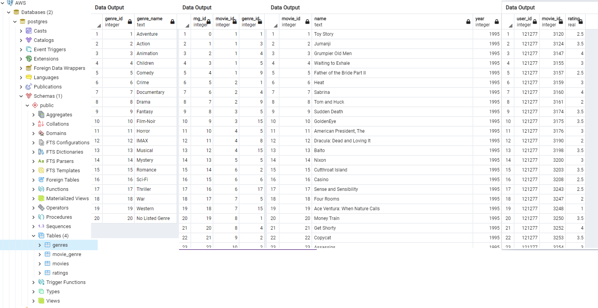

# Final-Project

### **Segment 2**:
Films

#### **Reason For Selection**:
The reason we selected this topic is because streaming services are currently on the rise. There are multiple streaming services to choose from and what's better than a streaming service that knows the consumer best? By taking our algorithm we are able to predict which new film would best fit the consumer. 

#### **Questions Considered**:
What rating would a new film receive, when considered against other films listed in the database? Combining the following: genre, director, cast, budget, ratings, etc. 

#### **Data Sources**:
- [MovieLens - Kaggle](https://www.kaggle.com/grouplens/movielens-latest-full)
- [TMDB 5000 Movie Dataset- Kaggle](https://www.kaggle.com/tmdb/tmdb-movie-metadata)
- [The Movies Dataset- Kaggle](https://www.kaggle.com/rounakbanik/the-movies-dataset?select=ratings_small.csv)

### Google Slides
[Google Slide](https://docs.google.com/presentation/d/1l5JNNvdjFWGLZJCt2bUP6EqvaZgqcJNhIDLShZntfgo/edit?usp=sharing)

### Roles
- Harry Manning (Square Role)
- Falguni Mital (Triangle Role)
- David Kaye (Circle Role)
- Daniel Villafane (Circle Role)
- Jorge Claros (X role)

### Communication Protocols:
1. Slack (Main point of Communication)
2. Zoom (Meeting 2-3 times a week outside of classtime)
3. Text Messages

### **Project Plan Overview**:

#### Technology Used:
* Jupyter notebook
* PostgresSQL

#### Preprocessing data:
- Pandas Corr method will be used to determine the correlation of specific features to the outcome to usderstand if a particular feature is important enough to be fed into the model.

#### Database & ERD Model:

##### PostgreSQL Database Layout
- 

#### Dashboard Examples

#### Machine Learning:
Regression techinique is used to find out the relationship between a single dependent variable (target variable) on the several independent ones (features). 

For this analysis several regression machine learning techniques from sklearn library are implemented to predict the movie ratings:

  - *Model Testing File:* [movies_ML_Analysis](movies_ML_Analysis.ipynb)
  1. Linear Regression:   finds out a linear relationship between a dependent variable and the other given independent variables.  Prone to overfitting and handles outliers badly.
  2. Lasso Linear Regressor: this technique is basically a shrinkage and variable selection method and it helps to determine which of the predictors are most important. The purpose of lasso is to stabilize the linear regression and make it more robust against outlier, overfitting.
  3. Random Forest Regressor:  this technique samples the data and build several smaller, simpler decision trees. Each tree is simpler because it is built from a random subset of features.
  
  - *Model Testing File:* [Static_Data_Algorithm_Testing](Static_Data_Algorithm_Testing.ipynb)
  4. Gaussian Process Regressor: generic supervised learning method designed to solve regression and probabilistic classification problems
  5. Decision Trees: Decision trees are good at capturing non-linear interaction between the features and the target variable. 
  6. Extra Tree Regressor - An extremely randomized tree regressor.  Extra-trees differ from classic decision trees in the way they are built
  7. KNeighbors Regressor - Regression based on k-nearest neighbors.  The target is predicted by local interpolation of the targets associated of the nearest neighbors in the training set.

Features:

- Movie Genre
- Movie Length
- Movie Cast
- Movie Year

Target:

- Movie Ratings

Dataset is split into two parts - 75% of the data is allocated to training and 25% is allocated to testing using train_test_split from sklearn library.

Model Evaluation:

R Squared will be used to determine how well each model has performed and the best performing model will be used to make movie recommendations.

Results:

The two linear regression techniques which gave the best R Squared values are:
- Decision Trees Regressor: 
    R Squared: 
- Random Forest Regressor: 
    R Squared:

The remaining techniques Linear Regresion, Lasso, Gaussian Process Regressor, KNeighbor Regressor resulted in lower R Squared values and were not considered and the Gaussian Regressor Technique requires more memory than currently availalbe on the machine to complete it.

The Decision Tress Regressor technique was chosen to predict the movie ratings as it provided the best R Squared values.  

R-squared of 20% is the percentage of the movie ratings variation that a linear model explains. The better the R-squared, the better the regression model fits the observations. 

Although R Squared value is low, it can improved by adding additional features to the model.

